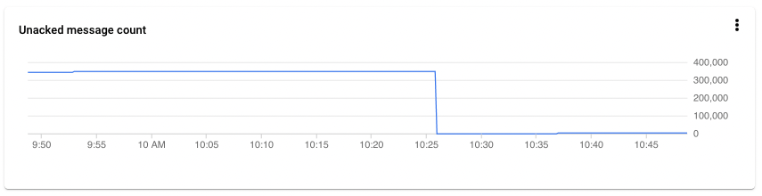

# kafka-2-pubsub

This demo showcases how to perform a live migration from Kafka to Google Cloud Pub/Sub with minimal downtime.

## Requirements

You need the following in your local environment:

* The Google Cloud CLI, configured with the appropriate credentials to create resources in your GCP project.
* Terraform.
* Docker.
* `kubectl`.

## Deployment

After cloning this repository, run the following command from the root directory:

```bash
make
```

This will invoke the deployment script (`scripts/deploy.sh`), which will do the following:

1. Run some sanity checks to make sure that everything is OK before proceeding.
2. Create some configuration files that depend on your environment variables (and which are not kept under version control).
3. Deploy the Terraform template.
4. Build some of the Docker images used in the demo.
5. Deploy all resources to the Kubernetes cluster.

(You can see all scripts under `scripts/` for further details.)

The above will take about 10 minutes to complete.

## Starting point

If all went good, the script would have deployed this:


There's a GKE cluster running the following:

* A standalone Kafka node (the `kafka` service).
* A standalone Zookeeper node (the `zookeeper` service).
* Two producer services (`producer-a` and `producer-b`), which are constantly publishing messages to Kafka.
* Two consumer services (`consumer-a` and `consumer-b`), which are constantly consuming messages from Kafka.

Both producers and consumers are in fact the same demo application, stored under `src/`. In a nutshell, it's a simple Python script that can be configured to either publish or subscribe, and to do so either with Kafka or Pub/Sub. This can be specified via environment variables. Feel free to take a look to understand its inner workings.

Outside of the GKE cluster, the following has already been deployed for you as well:

* A Pub/Sub topic (`kafka-2-pubsub`) with two subscriptions (`kafka-2-pubsub-subscription-a` and `kafka-2-pubsub-subscription-a`).
* An Artifact Registry repository where the custom Docker images are stored. The deployment script will have already push the images for you.
* IAM Service Accounts with the appropriate role bindings in order for everything to work as expected.

## Running the demo

### Initial assessment

First, let's take a look at what's currently running in our GKE cluster:

```
kubectl get pods
```

```
NAME                             READY   STATUS    RESTARTS   AGE
consumer-a-54df76d6fc-mlbl4      1/1     Running   0          58s
consumer-b-7fcb8d99bc-ltq4l      1/1     Running   0          57s
kafka-68944f58b5-mf782           1/1     Running   0          63s
kafkacat-7bd4d4678d-d6n8d        1/1     Running   0          61s
producer-a-58594f8d7f-tbmr9      1/1     Running   0          60s
producer-b-5c65d8c6b5-djjsm      1/1     Running   0          59s
zookeeper-755654df5-gq5hz        1/1     Running   0          65s
```

Let's take a look at the logs of one of the producers:

```
kubectl logs --follow deploy/producer-a
```

You'll see that producers are periodically sending messages to the message bus. Note that the bus currently in use is backed by Kafka, as noted in the `bus` payload attribute.

```
[...]
INFO:root:Message sent
INFO:root:Sending message via Kafka: {"from": "Producer A", "value": "1709e305-85d6-4a0f-8a28-59e2fb4b2e7d", "bus": "kafka"}
[...]
```

Let's do the same for one of the consumers:

```
kubectl logs --follow deploy/consumer-a
```

The consumer is receiving messages from both producers and, as you can see, those messages were originally posted to Kafka (as noted in the message payload) and received via Kafka as well (as per the message logs - `Received message via Kafka`).

```
[...]
INFO:root:Received message via Kafka, invoking callback...
INFO:root:Received data: b'{"from": "Producer A", "value": "5f334196-04e9-4003-b2cd-474d228fdb0e", "bus": "kafka"}'
INFO:root:Callback succeeded
INFO:root:Received message via Kafka, invoking callback...
INFO:root:Received data: b'{"from": "Producer B", "value": "e71e6eae-08e6-49b9-b8cf-a84f291fa606", "bus": "kafka"}'
INFO:root:Callback succeeded
[...]
```

As of this time, no messages are being sent to Pub/Sub. Let's confirm this by visiting the Pub/Sub console, then going to the Subscriptions page and clicking on either of the two subscriptions created by the demo (e.g., `kafka-2-pubsub-subscription-a`). Under the Messages tab, click *Pull* to temporarily receive messages. No messages should be received, which is expected at this time.

### Deploying Kafka Connect

Let's synchronize Kafka with Pub/Sub, so that messages published to the relevant Kafka topic are automatically sent to Pub/Sub. To this end we'll use Kafka Connect, which is the standard tool within the Kafka ecosystem to stream data between a Kafka cluster and other systems. Data is ingested into Kafka using _source connectors_, and delivered from Kafka using _sink connectors_. For the purposes of this demo we'll use [Google Cloud's Pub/Sub connector](https://github.com/GoogleCloudPlatform/pubsub/tree/master/kafka-connector).

The deployment script has already created a custom Docker image that includes Kafka Connect and the Pub/Sub connector already configured to send data to the `kafka-2-pubsub` Pub/Sub topic. (You can see more details by inspecting the `kafka-connect` folder, including the `Dockerfile` and `pubsub-connector.json`.)

A Kubernetes manifest is already available for you as well, so all you need to do is apply it:

```
kubectl apply -f infra/k8s/kafka-connect.yaml
```

After the pod goes into the `Running` state, Kafka Connect will still take some seconds to start up. You can follow progress by tailing the logs:

```
kubectl logs --follow deploy/kafka-connect
```

Once you see messages like these, we are all good:

```
[2022-07-11 08:35:43,183] INFO [Consumer clientId=connector-consumer-PubSubConnector-3, groupId=connect-PubSubConnector] Successfully joined group with generation Generation{generationId=2, memberId='connector-consumer-PubSubConnector-3-7e486e31-104b-483f-82a3-87b513e773e2', protocol='range'} (org.apache.kafka.clients.consumer.internals.ConsumerCoordinator)
[2022-07-11 08:35:43,186] INFO [Consumer clientId=connector-consumer-PubSubConnector-0, groupId=connect-PubSubConnector] Notifying assignor about the new Assignment(partitions=[kafka-2-pubsub-0]) (org.apache.kafka.clients.consumer.internals.ConsumerCoordinator)
[2022-07-11 08:35:43,189] INFO [Consumer clientId=connector-consumer-PubSubConnector-0, groupId=connect-PubSubConnector] Adding newly assigned partitions: kafka-2-pubsub-0 (org.apache.kafka.clients.consumer.internals.ConsumerCoordinator)
```

We can confirm that the connector is working by going back to the subscription details page in the Pub/Sub console and clicking *Pull* again. This time, messages from both producers should appear almost immediately.


### Migrating the consumers

[Google Cloud's recommended migration strategy](https://cloud.google.com/architecture/migrating-from-kafka-to-pubsub#planning_your_migration_to_pub_sub) involves migrating the consumers/subscribers first, then the producers/publishers later.

Open the `infra/k8s/demo-services.yaml`, which declares the Kubernetes deployments corresponding to both producers and consumers. Let's focus on `consumer-a`, specifically on the environment variables which govern its behavior:

```
env:
- name: K2PS_BUS_BACKEND
    value: "kafka"
- name: K2PS_KAFKA_TOPIC
    value: "kafka-2-pubsub"
- name: K2PS_KAFKA_BOOTSTRAP_SERVER
    value: "kafka:9092"
```

As you can see, the `K2PS_BUS_BACKEND` determines which backend should the consumer use. Note that this is specific of the demo app (which you can find under `src/`), so you can use a similar procedure in your app or a different method altogether.

The `K2PS_BUS_BACKEND` takes one of two allowd values: `kafka` and `pubsub`. Let's switch it to `pubsub` in order to change the backend to Pub/Sub. We also need to specify Pub/Sub specific settings, such as the topic and subscription (defined with the `K2PS_PUBSUB_TOPIC` and `K2PS_PUBSUB_SUBSCRIPTION` variables, respectively).

Thus, the end result should be this (remember to replace `<YOUR_GCP_PROJECT_NAME>` with the actual name of your GCP project):

```
env:
- name: K2PS_BUS_BACKEND
    value: "pubsub"
- name: K2PS_PUBSUB_TOPIC
    value: ""
- name: K2PS_PUBSUB_SUBSCRIPTION
    value: "projects/<YOUR_GCP_PROJECT_NAME>/subscriptions/kafka-2-pubsub-subscription-a"
```

(The `K2PS_PUBSUB_TOPIC` is left empty as it's not needed for message consumption, but our demo app needs both as it's used for both roles.)

Then apply the changes:

```
kubectl apply -f infra/k8s/demo-services.yaml
```

Once stabilized, let's tail Consumer A's logs to see how things are doing:

```
kubectl logs --follow deploy/consumer-a
```

If all went well, the consumer should be receiving messages from the two producers, just as before. However, even though messages are stil originally sent to Kafka (see the `bus=kafka` attribute in the message) note how the logs state `Received message via Pub/Sub`:

```
INFO:root:Received message via Pub/Sub, invoking callback...
INFO:root:Received data: b'{bus=kafka, from=Producer A, value=834c72e6-02ca-494f-acbf-d8b94de58b9e}'
INFO:root:Callback succeeded, message has been acknowledged
INFO:root:Received message via Pub/Sub, invoking callback...
INFO:root:Received data: b'{bus=kafka, from=Producer B, value=82d63679-cb6a-40f6-94f2-515824f7d956}'
INFO:root:Callback succeeded, message has been acknowledged
```

We can also check this in the Pub/Sub console: still in the subscription details page, if you select the *Metrics* tab you should see a sharp drop in the *Unacked message count* metric, which corresponds to the moment when the consumer began pulling messages from Pub/Sub.



To complete this part, let's repeat the steps above for Consumer B (remember to set the `K2PS_PUBSUB_SUBSCRIPTION` to `projects/<YOUR_GCP_PROJECT_NAME>/subscriptions/kafka-2-pubsub-subscription-b` instead of `subscription-a`).

### Migraging the producers

For this part, let's keep a terminal tab open with the logs of one of the consumers:

```
kubectl logs --follow deploy/consumer-a
```

Then let's edit `demo-services.yaml` and this time modify `producer-a`. The changes are just the same as before (although you can leave the `K2PS_PUBSUB_SUBSCRIPTION` empty as it's not really needed for message publishing). So, you would change the environment variables from this:

```
env:
- name: K2PS_BUS_BACKEND
    value: "kafka"
- name: K2PS_KAFKA_TOPIC
    value: "kafka-2-pubsub"
- name: K2PS_KAFKA_BOOTSTRAP_SERVER
    value: "kafka:9092"
```

To this:

```
env:
- name: K2PS_BUS_BACKEND
    value: "pubsub"
- name: K2PS_PUBSUB_TOPIC
    value: "projects/<YOUR_GCP_PROJECT_NAME>/topics/kafka-2-pubsub"
- name: K2PS_PUBSUB_SUBSCRIPTION
    value: ""
```

Then apply the changes (in a separate terminal):

```
kubectl apply -f infra/k8s/demo-services.yaml
```

And keep an eye on the logs in the other tab. After some seconds, you will see a change in the consumer logs:

```
INFO:root:Received message via Pub/Sub, invoking callback...
INFO:root:Received data: b'{bus=kafka, from=Producer B, value=dd70d54d-48f5-4c1c-8602-05a8ac7d074b}'
INFO:root:Callback succeeded, message has been acknowledged
INFO:root:Received message via Pub/Sub, invoking callback...
INFO:root:Received data: b'{"from": "Producer A", "value": "381f077e-7ff4-4706-808c-90a9e5352a88", "bus": "pubsub"}'
INFO:root:Callback succeeded, message has been acknowledged
```

While messages from Producer B are still sent via Kafka, note how messages from Producer A are sent directly to Pub/Sub (see the `bus` attribute). We can confirm this by tailing the producer logs:

```
kubectl logs --follow deploy/producer-a
```

```
INFO:root:Sending message via Pub/Sub: {"from": "Producer A", "value": "6052495b-50b1-4ea2-baed-08d574a8e38d", "bus": "pubsub"}
INFO:root:Message sent
```

To conclude, let's repeat the same steps with `producer-b`. You can use the exact same environment variables as the topic is the same. Once the changes are deployed, the consumer logs should reflect them as follows:

```
INFO:root:Received message via Pub/Sub, invoking callback...
INFO:root:Received data: b'{"from": "Producer A", "value": "ae58f819-53b7-4c9f-ad17-d93ba1838c4e", "bus": "pubsub"}'
INFO:root:Callback succeeded, message has been acknowledged
INFO:root:Received message via Pub/Sub, invoking callback...
INFO:root:Received data: b'{"from": "Producer B", "value": "7de8cf85-943e-4737-8944-3ab3c642e0b9", "bus": "pubsub"}'
INFO:root:Callback succeeded, message has been acknowledged
```

Note how both producers are now sending messages via Pub/Sub.

### Decommissioning Kafka

We can now remove Kafka and Kafka Connect from our GKE cluster, leaving only our producers and consumers:

```
kubectl delete -f infra/k8s/kafka-connect.yaml
kubectl delete -f infra/k8s/kafka.yaml
```

If you check the logs, you should see that all components are still up and running as they no longer depend on Kafka anymore.
